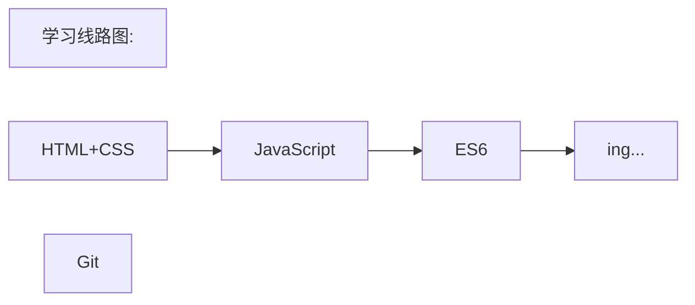

# 📑学习记录

**目录**

[**📕HTML+CSS**](web/)

[📕**JavaScript**](JavaScript/)

[📕**JavaScript进阶**](JavaScript_advanced/)

[**📕Git教程**](git/)

---

### 学习线路图

### 练习测试

- 阿里云开发者技能测试中心：https://developer.aliyun.com/exam
- 阿里云前端开发学习路线技能测试：https://edu.aliyun.com/roadmap/frontend

### 学习文档

- [网道-互联网开发文档](https://wangdoc.com/)：目前涵盖HTML、JavaScript、ES6、Web API、C语言、Bash、SSH七项学习内容

- [ES6 入门教程 阮一峰](https://es6.ruanyifeng.com/)：《ECMAScript 6入门》是一本开源的 JavaScript 语言教程，全面介绍 ECMAScript 6 新增的语法特性。
- 菜鸟教程：https://www.runoob.com/

### 参考手册

- MDN Web技术中文文档：https://developer.mozilla.org/zh-CN/
