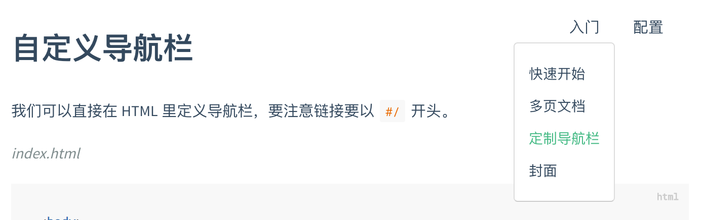

# Docsify折腾记

> &nbsp;&nbsp;&nbsp;&nbsp;&nbsp;&nbsp;&nbsp;&nbsp;一直想找一个简单又可以直接记录展示文档的快捷方式，便于在需要的时候能够快速查阅。尝试过WordPress、EmpireCMS、DedeCMS、ThinkPHP等系统，觉得臃肿还存在漏洞等困扰。直到无意间发现了VuePress，瞬间有种小清新的感觉，轻量、简洁、响应快！但每次需要构建生成静态文件。又想有没有那种上传markdown马上就能看到，这时Docsify出现了~ 简介明了，虽然页面很单调，但可以更专注！

### 1、简介
docsify 可以快速帮你生成文档网站。不同于 GitBook、Hexo 的地方是它不会生成静态的 .html 文件，所有转换工作都是在运行时。如果你想要开始使用它，只需要创建一个 index.html 就可以开始编写文档并直接部署。

官网地址：https://docsify.js.org/#/zh-cn/

### 2、特性
无需构建，写完文档直接发布
容易使用并且轻量 (压缩后 ~21kB)
智能的全文搜索
提供多套主题
丰富的 API
支持 Emoji
兼容 IE11
支持服务端渲染


---


# 入门

## 快速开始

### 手动初始化

npm太麻烦，创建 `docs` 目录，在里面直接手动创建一个 `index.html` 文件。

```html
<!DOCTYPE html>
<html>
<head>
  <meta http-equiv="X-UA-Compatible" content="IE=edge,chrome=1">
  <meta name="viewport" content="width=device-width,initial-scale=1">
  <meta charset="UTF-8">
  <link rel="stylesheet" href="//cdn.jsdelivr.net/npm/docsify/themes/vue.css">
</head>
<body>
  <div id="app"></div>
  <script>
    window.$docsify = {
      //...
    }
  </script>
  <script src="//cdn.jsdelivr.net/npm/docsify/lib/docsify.min.js"></script>
</body>
</html>
```

### 开始写文档

`docs` 目录下需要有以下几个文件：

- `index.html` 入口文件
- `README.md` 会做为主页内容渲染
- `.nojekyll` 用于阻止 GitHub Pages 忽略掉下划线开头的文件

直接编辑 `docs/README.md` 就能更新文档内容，当然也可以[添加更多页面](https://docsify.js.org/#/zh-cn/more-pages)。

### 本地预览

可以使用nginx等其它中间件，这里使用python。通过执行 `nohup python3 -m http.server 8000 >nohup.out 2>&1 &` 启动一个本地服务，方便实时预览效果。默认访问地址 http://localhost:8000 或 `IP:Port` 。

到这里咱们看到的是最简单的界面，更多的需要个性化定制。

### Loading 提示

初始化时会显示 `Loading...` 内容，你可以自定义提示信息。

```html
<!-- index.html -->
<div id="app">加载中</div>
```

如果更改了 `el` 的配置，需要将该元素加上 `data-app` 属性。

```html
<!-- index.html -->
  <div data-app id="main">加载中</div>

  <script>
    window.$docsify = {
      el: '#main'
    }
  </script>
```


---


## 多页文档

如果需要创建多个页面，或者需要多级路由的网站，在 docsify 里也能很容易的实现。例如创建一个 `guide.md` 文件，那么对应的路由就是 `/#/guide`。

假设你的目录结构如下：

```
.
└── docs
    ├── README.md
    ├── guide.md
    └── zh-cn
        ├── README.md
        └── guide.md
```

那么对应的访问页面将是：

```
docs/README.md        => http://domain.com
docs/guide.md         => http://domain.com/guide
docs/zh-cn/README.md  => http://domain.com/zh-cn/
docs/zh-cn/guide.md   => http://domain.com/zh-cn/guide
```


### 定制侧边栏

为了获得侧边栏，您需要创建自己的 `_sidebar.md` ，你也可以自定义加载的文件名。默认情况下侧边栏会通过 Markdown 文件自动生成，效果如当前的文档的侧边栏。

首先配置 `loadSidebar` 选项，具体配置规则见[配置项#loadSidebar](https://docsify.js.org/#/zh-cn/configuration?id=loadsidebar)。

```html
<!-- index.html -->

<script>
  window.$docsify = {
    loadSidebar: true
  }
</script>
<script src="//cdn.jsdelivr.net/npm/docsify/lib/docsify.min.js"></script>
```

接着创建 `_sidebar.md` 文件，内容如下：

```markdown
<!-- docs/_sidebar.md -->

* [首页](zh-cn/)
* [指南](zh-cn/guide)
```

需要在 `./docs` 目录创建 `.nojekyll` 命名的空文件，阻止 GitHub Pages 忽略命名是下划线开头的文件。


### 嵌套的侧边栏

你可能想要浏览到一个目录时，只显示这个目录自己的侧边栏，这可以通过在每个文件夹中添加一个 `_sidebar.md` 文件来实现。

`_sidebar.md` 的加载逻辑是从每层目录下获取文件，如果当前目录不存在该文件则回退到上一级目录。例如当前路径为 `/zh-cn/more-pages` 则从 `/zh-cn/_sidebar.md` 获取文件，如果不存在则从 `/_sidebar.md` 获取。

当然你也可以配置 `alias` 避免不必要的回退过程。

```html
<script>
  window.$docsify = {
    loadSidebar: true,
    alias: {
      '/.*/_sidebar.md': '/_sidebar.md'
    }
  }
</script>
```

> [!tip]你可以在一个子目录中创建一个 `README.md` 文件来作为路由的默认网页。


### 用侧边栏中选定的条目名称作为页面标题

一个页面的 `title` 标签是由侧边栏中选中条目的名称所生成的。为了更好的 SEO ，你可以在文件名后面指定页面标题。

```markdown
<!-- docs/_sidebar.md -->
* [Home](/)
* [Guide](guide.md "The greatest guide in the world")
```


### 显示目录

自定义侧边栏同时也可以开启目录功能。设置 `subMaxLevel` 配置项，具体介绍见 [配置项#subMaxLevel](https://docsify.js.org/#/zh-cn/configuration?id=submaxlevel)。

```html
<!-- index.html -->

<script>
  window.$docsify = {
    loadSidebar: true,
    subMaxLevel: 2
  }
</script>
<script src="//cdn.jsdelivr.net/npm/docsify/lib/docsify.min.js"></script>
```


### 忽略副标题

当设置了 `subMaxLevel` 时，默认情况下每个标题都会自动添加到目录中。如果你想忽略特定的标题，可以给它添加 `<!-- {docsify-ignore} -->` 。

```markdown
# Getting Started

## Header <!-- {docsify-ignore} -->

该标题不会出现在侧边栏的目录中。
```

要忽略特定页面上的所有标题，你可以在页面的第一个标题上使用 `<!-- {docsify-ignore-all} -->` 。

```markdown
# Getting Started <!-- {docsify-ignore-all} -->

## Header

该标题不会出现在侧边栏的目录中。
```

在使用时， `<!-- {docsify-ignore} -->` 和 `<!-- {docsify-ignore-all} -->` 都不会在页面上呈现。


---


## 定制导航栏

### HTML

如果你需要定制导航栏，可以用 HTML 创建一个导航栏。

> [!tip]注意：文档的链接都要以 `#/` 开头。

```html
<!-- index.html -->

<body>
  <nav>
    <a href="#/">EN</a>
    <a href="#/zh-cn/">中文</a>
  </nav>
  <div id="app"></div>
</body>
```


### 配置文件

那我们可以通过 Markdown 文件来配置导航。首先配置 `loadNavbar`，默认加载的文件为 `_navbar.md`。具体配置规则见[配置项#loadNavbar](https://docsify.js.org/#/configuration?id=loadnavbar)。

```html
<!-- index.html -->

<script>
  window.$docsify = {
    loadNavbar: true
  }
</script>
<script src="//cdn.jsdelivr.net/npm/docsify/lib/docsify.min.js"></script>
```

```markdown
<!-- _navbar.md -->

* [En](/)
* [简体中文](/zh-cn/)
```

> [!tip]你需要在 `./docs` 目录下创建一个 `.nojekyll` 文件，以防止 GitHub Pages 忽略下划线开头的文件。

`_navbar.md` 加载逻辑和 `sidebar` 文件一致，从每层目录下获取。例如当前路由为 `/zh-cn/custom-navbar` 那么是从 `/zh-cn/_navbar.md` 获取导航栏。


### 嵌套

如果导航内容过多，可以写成嵌套的列表，会被渲染成下拉列表的形式。

```markdown
<!-- _navbar.md -->

* 入门

  * [快速开始](zh-cn/quickstart.md)
  * [多页文档](zh-cn/more-pages.md)
  * [定制导航栏](zh-cn/custom-navbar.md)
  * [封面](zh-cn/cover.md)


* 配置
  * [配置项](zh-cn/configuration.md)
  * [主题](zh-cn/themes.md)
  * [使用插件](zh-cn/plugins.md)
  * [Markdown 配置](zh-cn/markdown.md)
  * [代码高亮](zh-cn/language-highlight.md)
```

效果图




### 整合自定义导航栏与 emoji 插件

如果你使用 [emoji 插件](https://docsify.js.org/#/plugins?id=emoji):

```html
<!-- index.html -->

<script>
  window.$docsify = {
    // ...
  }
</script>
<script src="//cdn.jsdelivr.net/npm/docsify/lib/docsify.min.js"></script>
<script src="//cdn.jsdelivr.net/npm/docsify/lib/plugins/emoji.min.js"></script>
```

例如，你可以在自定义导航栏 Markdown 文件中使用旗帜表情：

```markdown
<!-- _navbar.md -->

* [:us:, :uk:](/)
* [:cn:](/zh-cn/)
```


---


## 封面

通过设置 `coverpage` 参数，可以开启渲染封面的功能。具体用法见[配置项#coverpage](https://docsify.js.org/#/configuration?id=coverpage)。


### 基本用法

封面的生成同样是从 markdown 文件渲染来的。开启渲染封面功能后在文档根目录创建 `_coverpage.md` 文件。渲染效果如本文档。

`index.html`

```html
<!-- index.html -->

<script>
  window.$docsify = {
    coverpage: true
  }
</script>
<script src="//cdn.jsdelivr.net/npm/docsify/lib/docsify.min.js"></script>
```

```markdown
<!-- _coverpage.md -->


# docsify <small>3.5</small>

> 一个神奇的文档网站生成器。

- 简单、轻便 (压缩后 ~21kB)
- 无需生成 html 文件
- 众多主题

[GitHub](https://github.com/docsifyjs/docsify/)
[Get Started](#docsify)
```


### 自定义背景

目前的背景是随机生成的渐变色，我们自定义背景色或者背景图。在文档末尾用添加图片的 Markdown 语法设置背景。

`_coverpage.md`

```markdown
<!-- _coverpage.md -->

# docsify <small>3.5</small>

[GitHub](https://github.com/docsifyjs/docsify/)
[Get Started](#quick-start)

<!-- 背景图片 -->


<!-- 背景色 -->


```


### 封面作为首页

通常封面和首页是同时出现的，当然你也是当封面独立出来通过设置[onlyCover 选项](https://docsify.js.org/#/zh-cn/configuration?id=onlycover)。


### 多个封面

如果你的文档网站是多语言的，或许你需要设置多个封面。

例如你的文档目录结构如下

```text
.
└── docs
    ├── README.md
    ├── guide.md
    ├── _coverpage.md
    └── zh-cn
        ├── README.md
        └── guide.md
        └── _coverpage.m
```

那么你可以这么配置

```js
window.$docsify = {
  coverpage: ['/', '/zh-cn/']
};
```

或者指定具体的文件名

```js
window.$docsify = {
  coverpage: {
    '/': 'cover.md',
    '/zh-cn/': 'cover.md'
  }
};
```


---


# 定制化

## 配置项

这里就不全照搬官方了，实际上用不上那么多功能，仅简要列举部分。

你可以配置在 `window.$docsify` 里。

```
  <script>
    window.$docsify = {
      // 初始化的挂载元素
      el: '#app',
      // 渲染 GitHub Corner 挂件
      repo: 'docsifyjs/docsify',
      repo: 'https://github.com/docsifyjs/docsify/',
      // 侧边栏左侧的logo
      logo: '/_media/icon.svg',
      // 侧边栏顶部的标题
      name: 'docsify',
      // 点击标题后的跳转地址
      nameLink: '/',
      // 加载自定义导航栏，需有_navbar.md，支持自定义命名(增加loadNavbar: nav.md,)
      loadNavbar: true,
      // 加载自定义侧边栏，需要目录下有_sidebar.md文件
      loadSidebar: true,
      // 完全隐藏侧边栏
      hideSidebar: true,
      // 自动为每个页面增加标题(同时设置 loadSidebar 和 autoHeader 后)
      autoHeader: true,
      // 读取md文件最大层级
      subMaxLevel: 3,
      // 切换页面后跳回页面顶部
      auto2top: true,
      // 设置首页文件加载路径，适合不想将 README.md 作为入口
      homepage: 'home.md',
      // 文档加载的根路径，可以是二级路径或者是其他域名的路径。
      basePath: '/path/',
      // 启用封面页，加载 _coverpage.md 文件
      coverpage: true,
      // 只在访问主页时加载封面
      onlyCover: false,
      // 点击文档标题后跳转的链接地址
      nameLink: {
        '/zh-cn/': '/zh-cn/',
        '/': '/',
      },
      // 禁用 emoji 解析
      noEmoji: true,
      // 移动设备合并导航栏到侧边栏
      mergeNavbar: true,
      // 加载_404.md
      notFoundPage: true,
      // 替换主题颜色
      themeColor: "#fda085",
      // 定义路由规则
      alias: {
        '/.*/_sidebar.md': '/_sidebar.md'
      },
      // 搜索插件配置项
      search: {
          maxAge: 86400000,//过期时间,单位毫秒,默认一天
          paths: 'auto', // or 'auto'
          placeholder: '请输入搜索关键字',
          noData: '没有搜到呦!',
          depth: 6,
      },
    }
  </script>
```


```html
  <script>
    window.$docsify = {
      // 初始化的挂载元素
      el: '#app',
      // 侧边栏左侧的logo
      logo: '',
      // 侧边栏顶部的标题
      name: '📑学习笔记',
      // 点击标题后的跳转地址
      nameLink: '/',
      // 开启侧边栏，需要目录下有_sidebar.md文件
      loadSidebar: true,
      // 自动为每个页面增加标题
      autoHeader: true,
      // 读取md文件最大层级
      subMaxLevel: 3,
      // 切换页面后跳回页面顶部
      auto2top: true,
      // 移动设备合并导航栏到侧边栏
      mergeNavbar: true,
      // 加载_404.md
      notFoundPage: true,
      // 替换主题颜色
      themeColor: "#fda085",
      // 定义路由规则
      alias: {
        '/.*/_sidebar.md': '/_sidebar.md'
      },
      // 阅读进度条插件配置项(与侧边栏折叠有冲突)
      progress: {
          position: "top",
          color: "var(--theme-color,#42b983)",
          height: "3px",
      },
      // Tip文本高亮插件配置项
      'flexible-alerts': {
      style: 'flat',
      },
      // 搜索插件配置项
      search: {
          maxAge: 86400000,//过期时间,单位毫秒,默认一天
          paths: 'auto', // or 'auto'
          placeholder: '🔍请输入搜索关键字',
          noData: '😒没有搜到呦!',
          depth: 6,
      },
      // 复制代码插件配置项
      copyCode: {
        buttonText: '复制到剪贴板',
        errorText: '复制失败',
        successText: '复制成功',
      },
      // 分页导航插件配置项
      pagination: {
        previousText: '上一章节',
        // or
        nextText: {
          // '/en/': 'NEXT',
          '/': '下一章节'
        },
        crossChapter: true,
        crossChapterText: true,
      },
    }
  </script>
```


## 插件

同上，仅列举部分。jsdelivr在国内间歇性无法访问，有个公益 `jsdelivr镜像站 https://jsd.cdn.zzko.cn` 只需要替换域名就可以访问，也可以把这些js下载下来。

部分插件引入js文件后，可在 `配置项` 里自定义。例如：阅读进度条的大小、位置、颜色；Tip文本高亮风格；全文搜索的深度、缓存时间；复制按钮样式等。

```html
<!-- docsify v4-->
  <script src="//cdn.staticfile.org/docsify/4.13.1/docsify.min.js"></script>
<!-- 全文搜索插件 -->
  <script src="//cdn.staticfile.org/docsify/4.13.1/plugins/search.min.js"></script>
<!-- 复制代码插件 -->
  <script src="//cdn.staticfile.org/docsify-copy-code/2.1.1/docsify-copy-code.min.js"></script>
<!-- 分页导航插件 -->
  <script src="//cdn.jsdelivr.net/npm/docsify-pagination/dist/docsify-pagination.min.js"></script>
<!-- 缩放图片插件 -->
  <script src="//cdn.staticfile.org/docsify/4.13.1/plugins/zoom-image.min.js"></script>
<!-- 阅读进度条插件(与侧边栏折叠有冲突) -->
  <script src="//cdn.jsdelivr.net/npm/docsify-progress@latest/dist/progress.min.js"></script>
<!-- Tip文本高亮插件 -->
  <script src="//cdn.jsdelivr.net/npm/docsify-plugin-flexible-alerts"></script>
<!-- docsify-backTop插件 -->
  <script src="//cdn.jsdelivr.net/gh/Sumsung524/docsify-backTop/dist/docsify-backTop.min.js"></script>
```

## 其它插件

同上在 `window.$docsify` 里配置项，底部引入js。

### 页脚

```html
<script>
window.$docsify = {
      // 页脚信息插件配置项
      loadFooter: true,
      loadFooter: '_footer.md',
}
</script>
  <!-- 页脚信息 -->
  <script src="//cdn.jsdelivr.net/npm/@alertbox/docsify-footer/dist/docsify-footer.min.js"></script>
```

### emoji

默认是提供 emoji 解析的，能将类似 `:100:` 解析成 。但是它不是精准的，因为没有处理非 emoji 的字符串。如果你需要正确解析 emoji 字符串，你可以引入这个插件。

```html
<script src="//cdn.jsdelivr.net/npm/docsify/lib/plugins/emoji.min.js"></script>
```

> 如果你不想解析成表情符号，可以使用 `__colon__` 或 `&#58;` 。如果你需要在标题中使用，我们建议使用 `&#58;` 。例如， `&#58;100:` 。

