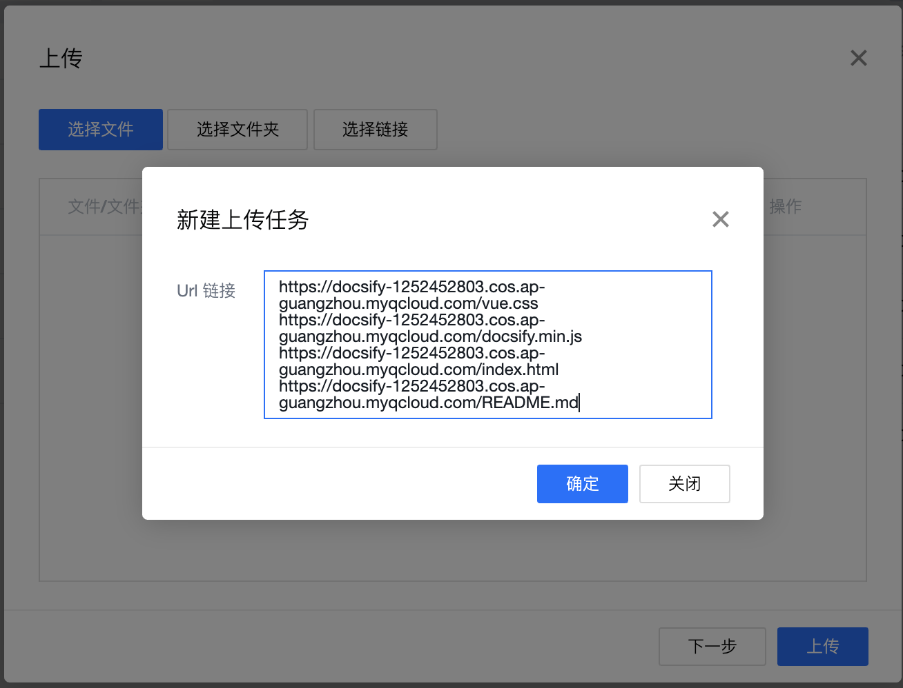

# Docsify+腾讯云对象存储 COS，一键搭建云上静态博客

## 前言
最近一直在想如何利用 COS 简化静态博客的搭建过程。搜了很多的静态博客搭建过程，发现大部分的静态博客都要通过编译才能生成静态页面。

功夫不负有心人，终于让我找到了一个超简洁博客的搭建方法。

效果预览：http://docsify-1252452803.file.myqcloud.com/

### 本文使用到工具：
1. [腾讯云对象存储](https://console.cloud.tencent.com/cos5)
2. [COSBrowser 客户端](https://console.cloud.tencent.com/cos5/cosbrowser)
3. [Docsify](https://docsify.js.org/#/zh-cn/)
4. 一颗能够写 [markdown](https://www.runoob.com/markdown/md-tutorial.html) 的聪明大脑 🧠

### 本文方法的优点：
1. **不需要安装 node**，谁都可以一键自动搭建；
2. 本地**不需**要全局安装 doscify；
3. **不需要**维护两份代码；
4. 若在写作过程中不小心把文件全删了，还可以恢复回来；
5. 一边写作一边刷新页面即可直接在线上看到结果。

下面，就让我来给大家瞅瞅，我是如何做到一键搭建云上静态博客。

------

## 前期准备工作

### 第一步：

首先，你要在[腾讯云对象存储控制台](https://console.cloud.tencent.com/cos5)创建一个存储桶。这里作为例子，我创建一个名为 docsify 的存储桶。地域可以就近选择，访问权限要选公有读私有写。

### 第二步

打开 COS 的静态网站功能。


------

## 一键搭建博客
下载 cosbrowser 客户端，用腾讯云账号登录，并进入刚刚创建的那个存储桶。

1. 打开客户端，并点击腾讯云账号登录。

2. 进入刚刚创建的存储桶

3. 点击上传按钮，选择链接文件上传，并将下列 url 文件资源复制到输入框中，然后点击上传。
```html
https://docsify-1252452803.cos.ap-guangzhou.myqcloud.com/vue.css
https://docsify-1252452803.cos.ap-guangzhou.myqcloud.com/docsify.min.js
https://docsify-1252452803.cos.ap-guangzhou.myqcloud.com/index.html
https://docsify-1252452803.cos.ap-guangzhou.myqcloud.com/README.md
```



------

## 开始写文档

上一步上传成功后，可以看到当前目录下创建的几个文件。
- `vue.css` 博客依赖的样式文件，不需要管
- `docsify.min.js` 博客依赖的脚本文件，不需要管
- `index.html` 博客的入口文件
- `README.md` 会做为主页内容渲染

直接在 COSBrowser 客户端编辑 `README.md` 就能更新主页内容显示，当然也可以添加更多页面。

### 多页文档

假设你存储桶的目录结构如下：
```
.
├── `index.html`
├── `README.md` 
└── docs
    ├── `README.md`
    └──  `guide.md`
```

那么对应的访问页面将是:

```
README.md        => http://docsify-1252452803.cos-website.ap-guangzhou.myqcloud.com/#/
docs/README.md   => http://docsify-1252452803.cos-website.ap-guangzhou.myqcloud.com/#/docs
docs/guide.md    => http://docsify-1252452803.cos-website.ap-guangzhou.myqcloud.com/#/docs/guide
```

### 定制侧边栏

为了获得侧边栏，您需要创建自己的`_sidebar.md`。您可以在 COSBrowser 新建 `_sidebar.md` 文件。默认情况下侧边栏会通过该文件自动生成。

首先配置 `loadSidebar` 选项，具体配置规则见配置项[#loadSidebar](https://docsify.js.org/#/zh-cn/configuration?id=loadsidebar)。

编辑 `index.html` 文件：
```js
window.$docsify = {
    ...,
    loadSidebar: true
}
```

然后编辑 `_sidebar.md` 文件
```markdown
<!-- docs/_sidebar.md -->

* [首页](docs/)
* [指南](docs/guide)
```

再刷新线上页面，即可看到侧边栏。

------

## 线上实时预览

在上述操作后，直接在浏览器打开 http://docsify-1252452803.cos-website.ap-guangzhou.myqcloud.com/ 就能在线上看到文档。

> 注意：
> 这里能够进行实时预览的链接为静态网站访问链接，不是加速域名链接。

每次编辑完后刷新浏览器页面就能实时看到更新后的文档内容。

但如果想要更新 CDN 缓存，则需要去 [CDN 控制台](https://console.cloud.tencent.com/cdn/refresh) 对该 url 进行刷新。

------

## 知识补充

### COSBrowser 如何进行文件恢复（找回历史文件）？

COSBrowser 客户端编辑窗口有一个小小的【时钟】按钮，点击该按钮可打开编辑器历史。但是该功能仅帮您保存最近 100 次所有文档编辑的记录。


若需要 COS 帮您自动**保存副本**，则可以开启存储桶的版本控制功能。


这样，您就可以在历史版本中下载该文件的历史版本并进行恢复了。

### 如何把截图上传到 COSBrowser？

您可以使用其他工具的快捷键在屏幕里截图，截好的图会自动存在剪辑版中。

当您在 COSBrowser 客户端用快捷键 CTRL+V 即可将截图上传到当前目录下。

### 如何在 .md 文档中引用图片？

您可以通过绝对路径或相对路径引用图片。

```
// 绝对路径引用图片


// 相对路径引用图片

```

### 如何为上传的图片加上万象的一些功能（如：水印）

如果是要为图片带上水印，可以直接在绝对路径/相对路径上加上 CI 的水印参数。[参考文档](https://cloud.tencent.com/document/product/460/6951)

```
// 绝对路径引用图片


// 相对路径引用图片

```


